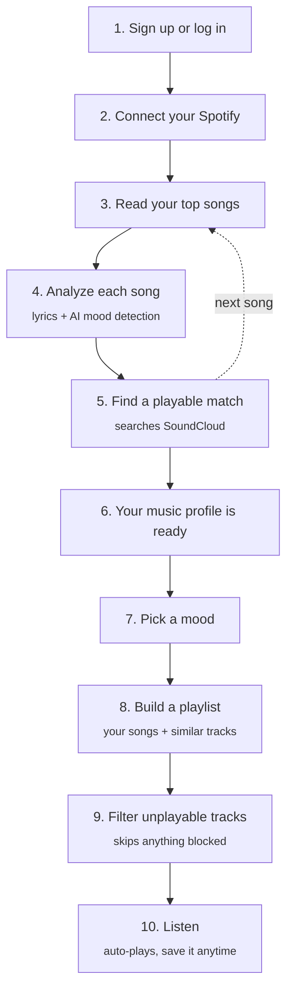

# MoodWave — Backend

The server behind [MoodWave](https://moodwave-frontend.vercel.app), an app that turns your Spotify listening habits into mood-based playlists you can play right in the browser.

Frontend repo: [MoodWave-Frontend](https://github.com/Carleton-BIT/MoodWave-Frontend)
Live API: `https://moodwave-6b5s.onrender.com`

## What it does

1. You connect your Spotify account.
2. MoodWave looks at your favorite songs, reads their lyrics, and figures out the general "vibe" of each one (happy, sad, chill, hype, etc.).
3. When you pick a mood, it builds you a playlist that matches — pulling from your own music taste plus similar tracks it finds on SoundCloud.
4. Everything plays right in the app, so you don't have to jump between apps to listen.

## How it all fits together

## Built with

- **Django** + **Django REST Framework** — the API itself
- **PostgreSQL** — stores accounts, songs, and playlists
- **Spotify API** — reads your top songs
- **SoundCloud API** — actually plays the songs
- An AI model that reads lyrics and estimates the mood of a song
- Hosted on **Render**

## Features

- Sign up / log in
- Connect your Spotify account
- Automatic mood tagging for your favorite songs
- Mood-based playlist recommendations
- Save and revisit your own playlists
- A simple stats page (your most common moods and genres)

